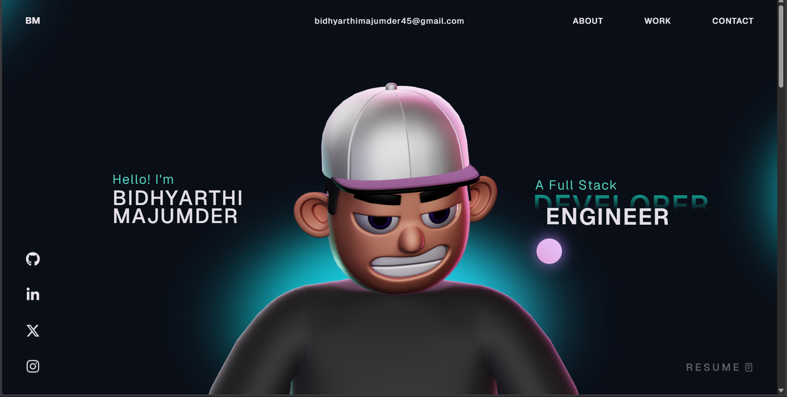

# My Portfolio Wesbite - Overview 🚀

## About this project
This portfolio website is built as a modern, interactive single-page experience. It combines smooth section animations (via GSAP) with rich 3D/WebGL visuals (via Three.js), while keeping the layout lightweight and responsive.

### What you can expect
* Animated landing and section transitions
* A “Work”/“Career” showcase for projects and experience highlights
* 3D visual effects rendered with WebGL
* Clean UI built with React + TypeScript

## Instructions 🛠️

I have modified the gsap club plugins with the trial plugins, but with the trial plugin you cannot host it🔴. So for Club plugins, Check out here: https://gsap.com/docs/v3/Installation/

**Techstack** - React, TypeScript, GSAP, ThreeJS, WebGL, HTML, Css, JavaScript

## License

This project is open source and available under the [MIT License](LICENSE).
